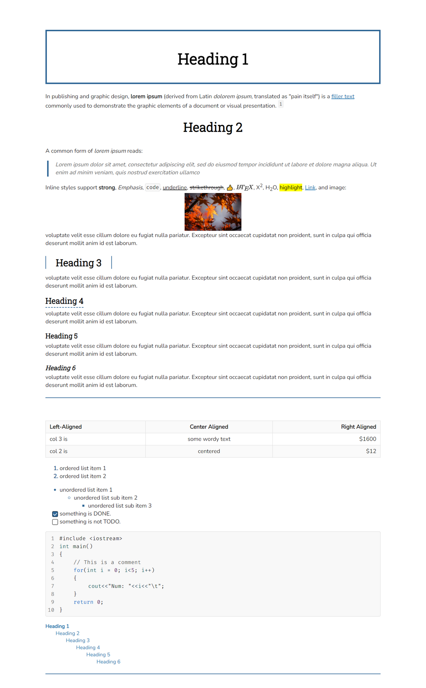
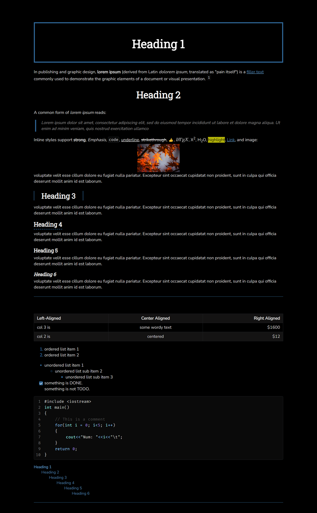

# typora-theme-paradox

Theme for Typora, a Markdown editor

Based on the Quartz theme from troennes (https://github.com/troennes/quartz-theme-typora)

## How to Install

1. Download the latest release from [here](https://github.com/george-paul/typoratheme-paradox/releases).
2. Extract the contents of `releaseX.zip`
3. Move the `paradox` folder and the the two `.css` files to your [Typora theme directory](https://theme.typora.io/doc/Install-Theme/).
4. Restart Typora.
5. Select the Theme from the `Themes` dropdown.

## Preview

**PDF Preview:** [Here](preview/preview.pdf)

### Paradox Seraph (Light Theme)

### Paradox Phantom (Dark Theme)

